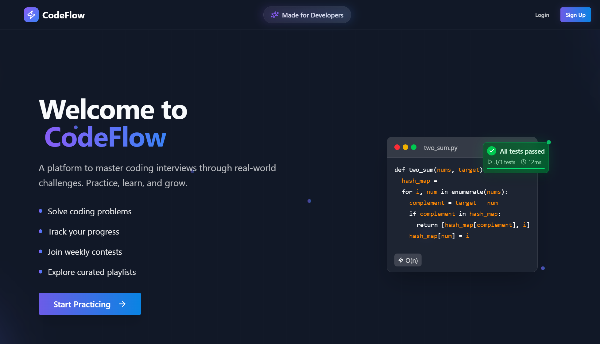
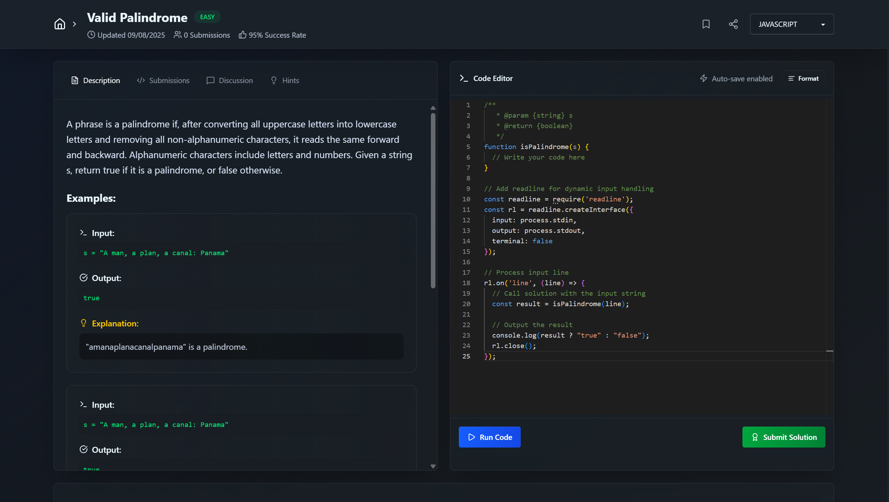

# CodeFlow Frontend

Frontend for **CodeFlow**, a LeetCode-style online coding platform. This React + Vite project provides users with a clean interface to browse problems, write code, and view results in real-time.


<div align="center">
	
</div>

---

## 🚀 Features

- Problem list view with filters and search
- Code editor with syntax highlighting
- Realtime output from backend via Judge0
- User signup, login, and JWT-based session handling
- Personalized dashboard (e.g., My Sheets, Progress)
- Clean and responsive UI (desktop + mobile)

---

## 🛠️ Tech Stack

- **Framework:** React
- **Build Tool:** Vite
- **Styling:** Tailwind CSS + DaisyUi
- **Code Editor:** Monaco Editor
- **State Management:** Zustand
- **API Client:** Axios
- **Routing:** React Router
- **Auth:** JWT + Cookies

---

## 📸 UI

Here’s a preview of the CodeFlow frontend :


<!-- Or use an external link:  -->

> ⚠️ Make sure to run both the frontend and backend servers for full functionality.

---

## 🔧 Setup Instructions

```bash
# Clone the repo
git clone https://github.com/Maverick341/codeflow-frontend.git

# Move into the directory
cd codeflow-frontend

# Install dependencies
npm install

# Start development server
npm run dev
```

> ⚠️ Make sure to configure environment variables for both development and production environments.

Create the following files in your project root:

### `.env.development`
```env
VITE_BACKEND_URL=http://localhost:8000/api/v1
```

### `.env.production`
```env
VITE_BACKEND_URL=https://your-production-domain.com/api/v1
```

> Replace `https://your-production-domain.com` with the actual URL of your deployed backend (e.g., Render, GCP, Railway).

---

## 🧩 Folder Structure

```
.
├── public/              
├── src/
│   ├── assets/          # Images and static assets
│   ├── components/      # Reusable UI components
│   ├── layout/          # Page layouts (e.g., Navbar, Footer)
│   ├── lib/             # Utility functions and helper libraries
│   ├── page/            # Route-based page components
│   ├── schemas/         # Validation schemas (e.g., zod/yup)
│   ├── store/           # Global state (e.g., Redux/Zustand)
│   ├── App.jsx
│   ├── index.css
│   └── main.jsx
├── .gitignore
├── .prettierignore
├── .prettierrc
├── eslint.config.js
├── index.html
├── package.json
├── vite.config.js
└── README.md
```

---

## 🤝 Contributing

Pull requests are welcome! To contribute:

1. Fork the repo
2. Create your feature branch (`git checkout -b feature/YourFeature`)
3. Commit your changes (`git commit -m 'Add YourFeature'`)
4. Push to the branch (`git push origin feature/YourFeature`)
5. Open a Pull Request

---

## 📄 License

This project is licensed under the **MIT License**.

---

## 🌐 Related Repositories

- 🔗 [Backend Repository](https://github.com/Maverick341/codeflow-backend)
